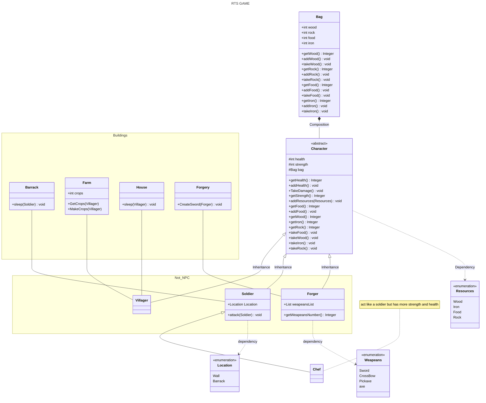
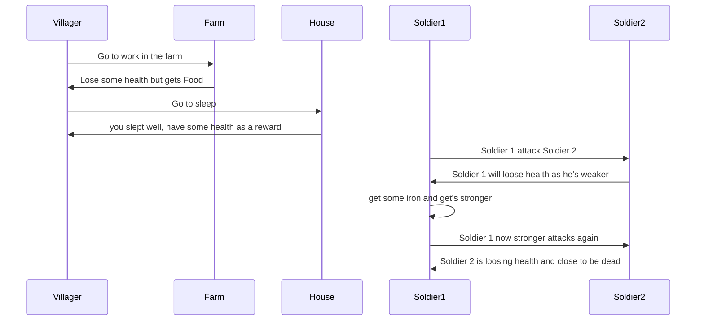
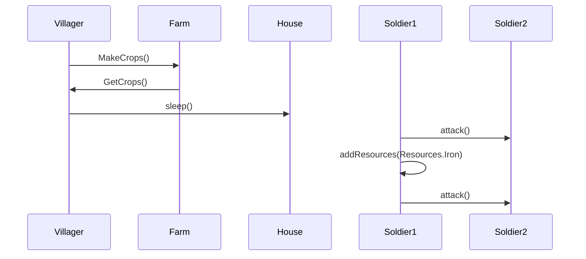

```mermaid
---
title : RTS GAME
---

classDiagram
    
    class Character
    <<abstract>> Character
    
    Character <|-- Villager :  Inheritance
    Character <|-- Soldier : Inheritance
    Character <|-- Forger : Inheritance

    Character : #int health
    Character : #int strength
    Character: #Bag bag
    Character : +getHealth() Integer
    Character : +addHealth() void
    Character : +TakeDamage() void
    Character : +getStrength() Integer
    Character : +addResources(Resources) void
    Character: +getFood() Integer
    Character: +addFood() void
    Character: +getWood() Integer
    Character: +getIron() Integer
    Character: +getRock() Integer
    Character: +takeFood() void
    Character: +takeWood() void
    Character: +takeIron() void
    Character: +takeRock() void
    
    Soldier <|-- Chef
    Character ..> Resources : Dependency

    Bag *-- Character : Composition

    Soldier : +Location Location

    class Location
    <<enumeration>> Location

    Location : Wall
    Location : Barrack

    class Weapeans 
    <<enumeration>> Weapeans

    Weapeans: Sword 
    Weapeans: CrossBow
    Weapeans: Pickaxe
    Weapeans: axe

    Forger ..> Weapeans : dependency

    Soldier ..> Location : dependency
    Soldier : +attack(Soldier) void

    Forger: +List weapeansList
    Forger: +getWeapeansNumber() Integer

    namespace Not_NPC {
        class Soldier
        class Forger
        class Villager
    }

    class Resources
    <<enumeration>> Resources
    
    Resources : Wood
    Resources : Iron
    Resources : Food
    Resources : Rock
    
    
    note for Chef "act like a soldier but has more strength and health"

    namespace Buildings {
        class Barrack
        class Farm
        class House
        class Forgery
    }
    
    Barrack: +sleep(Soldier) void
    Farm: +int crops
    Farm: +GetCrops(Villager)
    Farm: +MakeCrops(Villager)
    Forgery: +CreateSword(Forger) void
    House: +sleep(Villager) void

    Barrack -- Soldier
    Farm -- Villager
    House -- Villager
    Forgery -- Forger

    class Bag {
        +int wood 
        +int rock 
        +int food 
        +int iron 
        +getWood() Integer
        +addWood() void
        +takeWood() void
        +getRock() Integer
        +addRock() void
        +takeRock() void
        +getFood() Integer
        +addFood() void
        +takeFood() void
        +getIron() Integer
        +addIron() void
        +takeIron() void
    }
```

```mermaid
sequenceDiagram
Villager ->> Farm: Go to work in the farm
Farm ->> Villager: Lose some health but gets Food
Villager ->> House : Go to sleep
House ->> Villager : you slept well, have some health as a reward

Soldier1 ->> Soldier2 : Soldier 1 attack Soldier 2
Soldier2 ->> Soldier1 : Soldier 1 will loose health as he's weaker 
Soldier1 ->> Soldier1 : get some iron and get's stronger
Soldier1 ->> Soldier2 : Soldier 1 now stronger attacks again
Soldier2 ->> Soldier1 : Soldier 2 is loosing health and close to be dead
```

```mermaid
sequenceDiagram
Villager ->> Farm: MakeCrops()
Farm ->> Villager: GetCrops()

Villager ->> House : sleep()

Soldier1 ->> Soldier2 : attack()
Soldier1 ->> Soldier1 : addResources(Resources.Iron)
Soldier1 ->> Soldier2 : attack()
```
